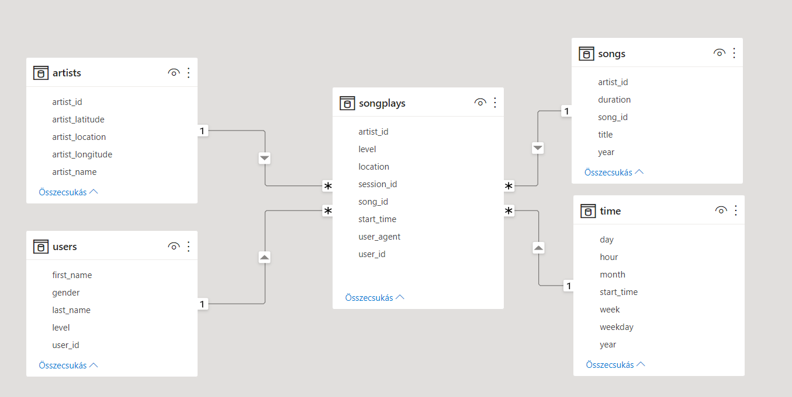

#Sparkify ETL Data Warehouse on Amazon Redshift
---
##Project details
Name: ETL Pipeline in AWS Redshift and S3
Audience: Udacity Data Engineering Course
Created by: Mihaly Garamvolgyi

##Introduction

A music streaming startup, Sparkify, has grown their user base and song database and want to move their processes and data onto the cloud. Their data resides in S3, in a directory of JSON logs on user activity on the app, as well as a directory with JSON metadata on the songs in their app.

This project is building an ETL pipeline that extracts their data from S3, stages them in Redshift, and transforms data into a set of dimensional tables for their analytics team to continue finding insights into what songs their users are listening to. 

##Project Description

This project is to build an ETL pipeline for a database hosted on Redshift. Data is loaded from S3 to staging tables on Redshift and SQL statements are executed that create the analytics tables from these staging tables.

##Project Datasets

There are two datasets that reside in S3. 

Song data: `s3://udacity-dend/song_data`
Log data: `s3://udacity-dend/log_data`
Log data json path: `s3://udacity-dend/log_json_path.json`

##Database design

Start schema as follows:


##Tables

###Fact table
`songplays` every occurrence of a song being played.

###Dimension tables
`users` the users of music streaming application
`songs` the songs in the catalog
`artists` the artists in the catalog
`time` the timestamps of records in songplays


##Project Structure

`create_tables.py` - Prepares tables.
`etl.py` - Load queries that extract JSON data from the S3 bucket and injects to database.
`sql_queries.py` - Contains all required sql scripts 
`dhw.cfg` - Config file with credentials

##How to run 

```
$ python create_tables.py
```

```
$ python etl.py
```